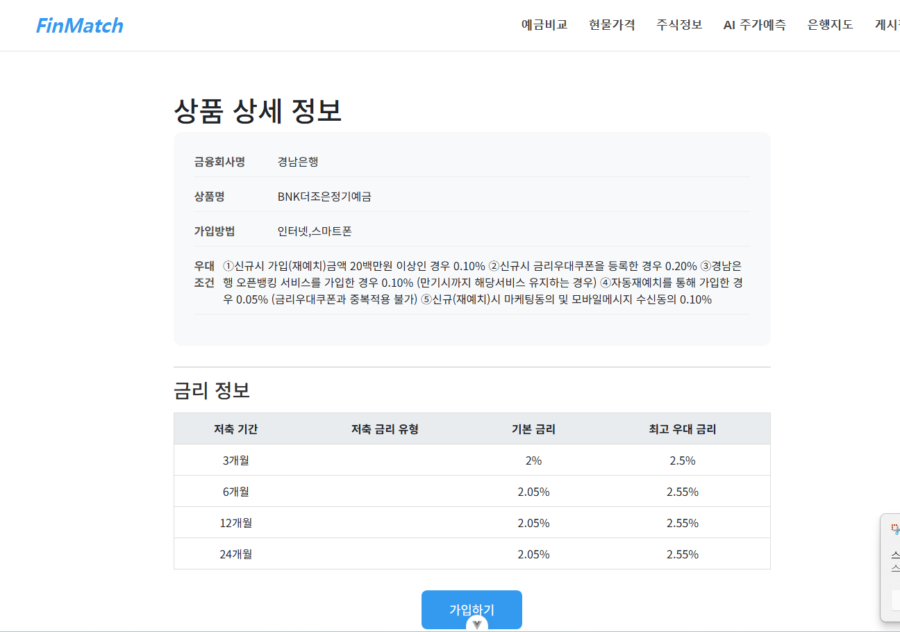
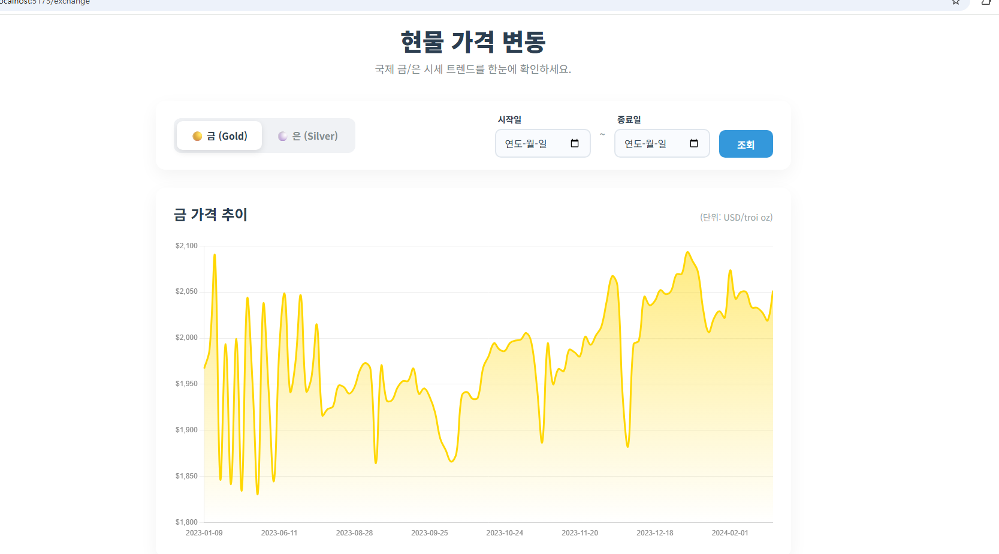
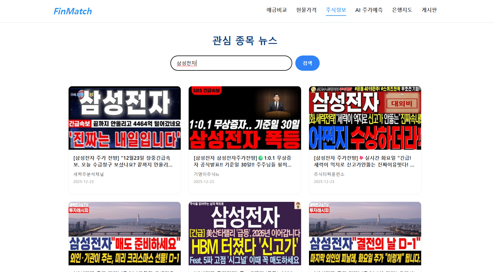
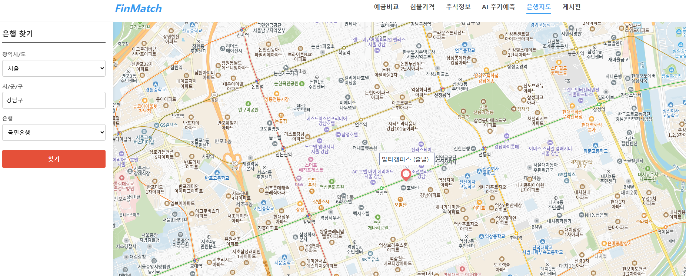
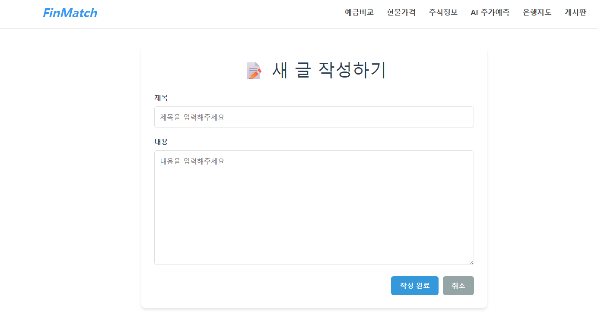

💰 FinMatch (핀매치) - 스마트한 금융 자산 관리 플랫폼

1. 👨‍💻 팀원 정보 및 역할 분담

이름

역할

담당 업무 (Frontend/Backend)

장영철

팀장 / Full Stack

- Frontend 총괄: Vue 3 전체 구조 설계 및 UI/UX 디자인/구현 (메인, 프로필, 커뮤니티 등)

- Core Backend: Django 서버 초기 구축, DB 모델링 및 User 인증(Auth) 시스템 구현

- Map & Chart: Kakao Maps API 및 Chart.js 프론트엔드 시각화 연동

- State Management: Pinia 스토어 설계 및 Axios 비동기 통신 모듈화

양한빈

팀원 / AI & Backend

- AI Modeling (TFT-R): LSTM 및 Temporal Fusion Transformer 기반 주가 예측 모델 'Beast' 개발

- MLOps Pipeline: MLflow 실험 관리 및 FastAPI 기반 실시간 추론(Inference) 마이크로서비스 구축

- Data Engineering: yfinance 대용량 시계열 데이터(20년치) 전처리 및 노이즈 필터링(VSN)

- Financial Logic: 금융감독원/환율 데이터 파싱 및 시뮬레이션 로직(ROI 분석) 구현

2. 📝 서비스 개요

FinMatch는 복잡한 금융 정보를 한눈에 파악하고, 개인 맞춤형 금융 상품을 추천받을 수 있는 웹 서비스입니다. 예적금 금리 비교부터 현물 자산 시세 확인, 주변 은행 찾기, 그리고 SOTA 딥러닝 기술이 적용된 AI 주가 예측까지 All-in-One 금융 솔루션을 제공합니다.

🛠 기술 스택

Frontend: Vue 3, Pinia, Vue Router, Axios, Chart.js

Backend: Django REST Framework, dj-rest-auth, Pandas

AI/ML: TensorFlow, Keras, Temporal Fusion Transformer (TFT), MLflow, FastAPI

Database: SQLite (개발용) / PostgreSQL (배포용 - 선택사항)

APIs:

금융감독원 금융상품통합비교공시 API

Youtube Data API v3

Kakao Map API / Kakao Mobility API

OpenAI API (금융 상품 추천 챗봇)

3. 🌟 주요 기능 설명

A. 메인 페이지 (Main Page)

서비스의 핵심 기능을 한눈에 볼 수 있는 직관적인 레이아웃.

Carousel을 활용한 프로모션 배너 및 서비스 소개.

반응형 웹 디자인(Responsive Design)을 적용하여 모바일/데스크탑 환경 최적화.

B. 회원 관리 (Authentication)

Django AbstractUser를 상속받은 커스텀 유저 모델 사용.

JWT 기반의 회원가입, 로그인, 로그아웃 기능.

C & D & E. 예적금 조회 및 관리 (Deposit & Savings)

데이터 수집: 금융 API를 통해 1금융권 및 저축은행의 예적금 데이터를 DB에 저장.

상세 조회: 상품별 상세 옵션(기간, 금리) 확인 및 '가입하기' 기능을 통해 마이페이지 포트폴리오 연동.

F. 현물 상품 시각화 (Commodities)

금(Gold), 은(Silver)의 과거 시세 데이터를 차트로 시각화.

기간 설정에 따른 동적 그래프 렌더링.

G & H. AI 주가 예측 (Stock Prediction - TFT-R)

실시간 예측: 사용자가 요청하는 즉시 최신 주가 데이터를 수집하여 향후 등락률을 예측.

매매 신호 제공: 단순 수치가 아닌 '강력 매수', '보유', '매도' 등의 직관적인 투자 시그널 제공.

예측 근거 시각화: 최근 20일간의 데이터를 기반으로 AI가 분석한 추세 차트 제공.

I & J. 근처 은행 찾기 및 경로 안내 (Map & Route)

은행 검색: Kakao Map API를 활용하여 현재 위치 또는 지정 위치 기반 주변 은행 마커 표시.

경로 안내: Kakao Mobility API를 연동하여 최적 경로(Polyline) 시각화.

L. 프로필 및 포트폴리오 (Profile)

포트폴리오 차트: 사용자가 가입한 금융 상품들의 금리와 자산 비중을 시각적으로 비교 분석.

4. 🧠 핵심 알고리즘 기술적 설명

1) AI 주가 예측 엔진 (TFT-R: Temporal Fusion Transformer)

본 프로젝트의 핵심인 주가 예측 서비스는 단순 시계열 모델(LSTM)을 넘어, 최신 트랜스포머 아키텍처를 금융 데이터에 최적화한 TFT-R(Regressor) 모델을 탑재했습니다.

모델 아키텍처:

VSN (Variable Selection Network): 14개의 복잡한 거시경제 변수 중 노이즈를 스스로 제거하고, 가격에 결정적 영향을 미치는 5개 핵심 피처(OHLCV)만을 동적으로 선별합니다.

Stacked LSTM: 20일간의 장기 추세(Trend)와 단기 변동성(Volatility)을 통합 인코딩하여 가격의 흐름(Context)을 학습합니다.

Multi-Head Attention: 과거 데이터 중 현재 수익률에 가장 큰 영향을 주는 '골든 타임(Alpha)'을 찾아내어 가중치를 부여합니다.

성과:

초기 14-Feature 분류 모델 대비, 노이즈를 제거한 5-Feature 회귀 모델이 압도적인 성과를 기록했습니다.

최고 ROI 292.45%, 평균 ROI 103.68% (시뮬레이션 기준) 달성.

시스템 아키텍처:

Django 서버의 부하를 줄이기 위해 AI 추론 엔진을 FastAPI 마이크로서비스로 분리하여 구축했습니다.

2) 사용자 맞춤형 금융 상품 추천 (Hybrid Filtering)

Collaborative Filtering: 사용자 유사도(나이, 자산, 연봉) 기반으로 검증된 예적금 상품 추천.

OpenAI GPT 연동: 사용자의 자연어 질의("사회초년생을 위한 공격적인 투자 상품 추천해줘")를 분석하여 투자 성향에 맞는 포트폴리오 제안.

5. 🤖 생성형 AI 활용 내용

데이터 생성 및 검증: 추천 알고리즘 테스트를 위해 가상의 사용자 페르소나 및 금융 거래 데이터를 생성하여 시나리오별 검증 수행.

코드 최적화: 복잡한 TensorFlow 모델링 코드와 Vue 3의 비동기 처리 로직 작성 시 AI의 제안을 받아 리팩토링 및 버그 수정.

디자인 보조: 차트 라이브러리(Chart.js) 옵션 설정 및 반응형 CSS 레이아웃 구성 시 AI 도구를 활용하여 개발 속도 향상.

6. 💬 프로젝트 후기 및 느낀 점

장영철 (팀장)

"프론트엔드와 백엔드를 모두 아우르며 프로젝트 전체 흐름을 잡는 데 집중했습니다. 특히 Django 서버의 기본 골격을 잡고 Vue 컴포넌트들을 유기적으로 연결하는 과정에서 풀스택 개발의 매력을 느꼈습니다. 카카오맵과 차트를 연동하여 데이터를 시각화하는 과정이 까다로웠지만, 사용자에게 직관적인 경험을 제공할 수 있어 보람찼습니다."

양한빈 (팀원) - [데이터 사이언티스트의 양심과 성장]

"초기에는 '분류 모델이 회귀 모델보다 우월하다'는 가설을 입증하기 위해 수많은 실험을 진행했습니다. 하지만 우연한 실수로 발견한 **'단순한 5개 피처의 회귀 모델'**이 훨씬 압도적인 수익률(100% 이상)을 내는 것을 목격했습니다. 기존에 준비했던 복잡한 모델과 보고서를 폐기해야 하는 상황에서, 기술적 고집보다 **'데이터가 보여주는 진실'**을 따르는 것이 엔지니어의 양심임을 깨달았습니다. 화려한 알고리즘보다 정제된 데이터의 힘이 강력함을 증명한 뜻깊은 프로젝트였습니다."

실행화면 

